# Construccion de ciudades Sprint 2

## 1. Configuración inicial del tablero Kanban y el Product Backlog

- **Tablero Kanban**: Se creó el tablero Kanban en GitHub para gestionar y visualizar el progreso del Sprint 1. El tablero contiene las siguientes columnas:
    - **Backlog**: Todas las tareas que aún no han sido trabajadas.
    - **In Progress**: Tareas que están siendo implementadas.
    - **In Review**: Tareas listas para ser revisadas.
    - **Done**: Tareas completadas.
      
- Historias clave para el Sprint 2:
    - **Mejora de Edificios**
    - **Recompensa por completar objetivos**
    - **Acceso a la informacion de la ciudad**

## 2. Historias de usuario con criterios de aceptación en Gherkin

Se escribieron las historias de usuario utilizando la sintaxis Gherkin para facilitar la definición clara de criterios de aceptación.

### Se crearon las siguientes historias de usuario

**Historia de Usuario 1: Mejora de Edificios**

**Como**  jugador

**Quiero** que los edificios se puedan mejorar si tengo suficientes recursos

**Para** poder optimizar el desarrollo de mi ciudad

## Detalles y suposiciones
* Las mejoras dependen de la cantidad de recursos disponibles.
* Las mejoras  ocurren cuando el jugador tiene los recursos necesarios.

## Criterios de aceptación

```gherkin
Given el jugador tiene suficientes recursos
When el sistema detecta los recursos disponibles
Then el edificio se mejora al siguiente nivel
```
**Historia de Usuario 2: Recompensa por completar objetivos**

**Como**  jugador.

**Quiero**  recibir recompensas por completar objetivos en el juego.

**Para**  motivarme a seguir mejorando mi ciudad.

## Detalles y suposiciones

* El sistema debe otorgar recompensas cuando los jugadores completan hitos o metas.
* Las recompensas pueden ser en forma de recursos o desbloqueo de nuevas características.

## Criterios de Aceptación

```gherkin
Given el jugador tiene una ciudad con un nivel actual de "1".
And el jugador ha construido 5 edificios.
When el sistema detecta que el jugador ha alcanzado el objetivo de 5 edificios.
Then la ciudad sube al nivel 2.
And el jugador recibe una recompensa de 10 unidades adicionales de cada recurso.
```

**Historia de Usuario 3: Acceso a la informacion de la ciudad**

**Como** jugador.

**Quiero** ver un resumen de la situación de mi ciudad (recursos, edificios).

**Para**  poder tomar decisiones estratégicas para el crecimiento de mi ciudad.

## Detalles y suposiciones
* Los jugadores deben poder acceder a un resumen detallado de los recursos disponibles, los edificios construidos y la población de la ciudad.
* Esta información se actualiza en tiempo real y es clave para la planificación.
## Criterios de aceptación

```gherkin
Given  el jugador accede al panel de información.
When el jugador revisa el resumen de la ciudad.
Then el sistema muestra el estado de los recursos, edificios.
```

## 3. Labels sugeridos y su uso

Se crearon algunos labels para luego asignarlos a cada historia de usuario, segun sus características y funcionalidad

### 1. Segun su Prioridad

- **high priority**: Para indicar que una historia de usuario o tarea es de alta prioridad.
- **medium priority**: Para elementos de prioridad media.
- **low priority**: Para ítems que no requieren atención inmediata.

### 2. Segun su tipo de tarea

- **enhancement**: Etiqueta para mejoras solicitadas o nuevas características que se desean agregar al proyecto. Se usa para separar las mejoras o nuevas funcionalidades de los problemas existentes.
- **ci/cd**: Para elementos de prioridad media.
- **technical debt**: Para marcar aquellas historias que no aportan valor visible al cliente pero deben completarse para continuar con el desarrollo.

## 4. Añadir labels a las historias

Procederemos a etiquetar cada historia de usuario con su label correspondiente , segun su funcionalidad y función.


**Historia de Usuario 1: Mejora de Edificios**
- **Label:** ```medium priority```
- **Justificación:** Las mejoras  optimizan la jugabilidad, pero no son fundamentales en las primeras etapas. Se pueden implementar una vez que la funcionalidad básica de los edificios esté lista.


- **Label:** ```enhancement```
- **Justificación:** La mejora de edificios es una característica adicional que optimiza la jugabilidad, mejorando la experiencia del jugador sin necesidad de intervención constante.


**Historia de Usuario 2: Recompensa por completar objetivos**

- **Label:** ```high priority```
- **Justificación:** Las recompensas mejoran la motivación del jugador, por eso son esenciales al inicio del proyecto.

- 
- **Label:** ```enhancement```
- **Justificación:** La implementación de un sistema de recompensas es una mejora de la jugabilidad, motivando al jugador a continuar jugando y mejorar su ciudad.


**Historia de Usuario 3: Acceso a la informacion de la ciudad**

- **Label:** ```low priority```
- **Justificación:** Si bien tener un resumen de la ciudad es útil, no es una funcionalidad imprescindible en las primeras versiones del juego.

- **Label:** ```enhancement```
- **Justificación:** Permitir que los jugadores accedan a un resumen detallado de la situación de su ciudad es una mejora significativa en la funcionalidad de monitoreo y gestión del juego.
  .


## 5. Asignación de puntos de historia

Para asignar puntos de historia a cada una de las historias de usuario del proyecto, tomaremos en cuenta la **complejidad**, el **esfuerzo** requerido y la **incertidumbre**. Utilizaré la **secuencia de Fibonacci** (1, 2, 3, 5, 8, 13, etc.) como referencia, donde:

- **1 punto**: Historia muy simple, poca o ninguna complejidad.
- **2 puntos**: Relativamente sencilla, con poco esfuerzo o complejidad.
- **3 puntos**: Moderada complejidad, requerirá más esfuerzo pero no demasiada incertidumbre.
- **5 puntos**: Historia compleja, con más trabajo y algún nivel de incertidumbre.
- **8 puntos**: Historia con mucha complejidad o incertidumbre, que requerirá un esfuerzo considerable.
- **13 puntos**: Historia muy compleja con alta incertidumbre, probablemente requiera bastante investigación.

**Historia de Usuario 1:  Mejora de Edificios
**

- **Puntos de historia :** ```5```
- **Justificación:** La implementación de mejoras automáticas agrega complejidad, ya que debe validar continuamente la disponibilidad de recursos y aplicar la mejora sin intervención manual. También es importante la integración con la lógica de los edificios y los recursos, lo que añade un esfuerzo adicional.


**Historia de Usuario 2:  Recompensas por Completar Objetivos
**

- **Puntos de historia :** ```3```
- **Justificación:**La lógica para recompensar al jugador es relativamente sencilla. La mayor parte del esfuerzo radica en la integración de las recompensas con el sistema de objetivos. La complejidad es moderada y no hay demasiada incertidumbre.

**Historia de Usuario 3: Acceso a la Información de la Ciudad
**

- **Puntos de historia :** ```3```
- **Justificación:** Acceder a la información de la ciudad en tiempo real tiene una complejidad moderada, ya que requiere la visualización y actualización continua de los recursos y edificios. Aunque no es tan complejo como la monitorización en tiempo real, sigue siendo una funcionalidad importante.


## 6. Asignación de miembros a cada historia de usuario

Nos hemos asignado cada historia de usario de acuerdo a el conocimiento y la capacidad de cada uno, siendo asi la creacion de ramas especificas para cada entidad, en este caso **ciudad**, **recursos** y **edificios**

- **Mejora de Edificios** Sergio Gil
- **Recompensa por completar objetivos** Sergio Gil
- **Acceso a la informacion de la ciudad** Kevin Palomino

## 7. Configuración de Sprints y reacion del Spring Blacklog 

Se introduce **"Sprint2"** como el nombre del campo, eligimos **"Iteration"** como el tipo de campo. Mantenmos la duración en una semana

Luego de asginar los puntos de historia estimados y un sprint, y moveremos las historias del Product Backlog al Sprint Backlog para construir nuestro plan.


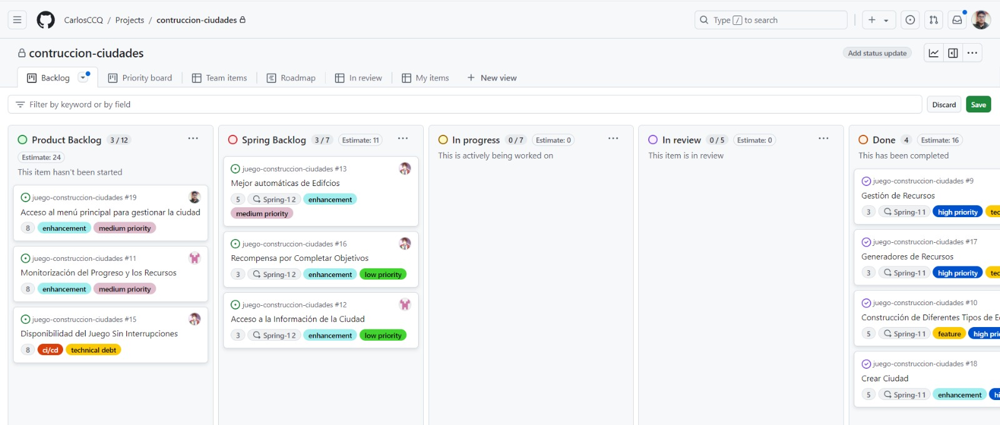


Ahora movemos que ya nos asignamos moveremos a la columna In progress para que se de a conocer que ya se esta trabandoesa historia de usuario en dicha rama.

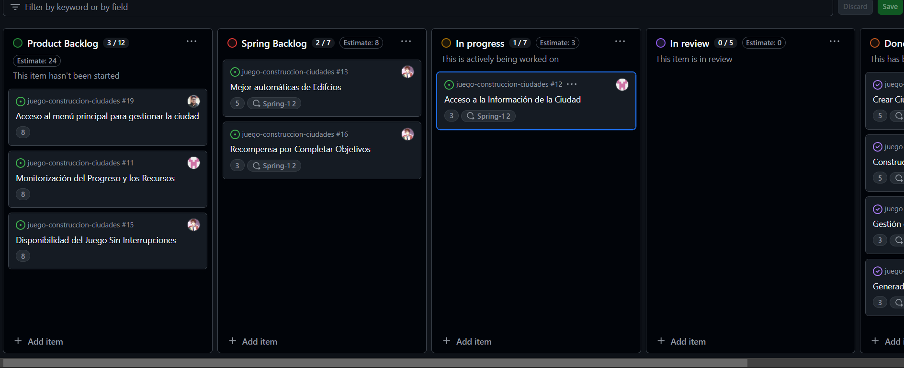

Una vez que se termine de trabajar en la historia, es momento de solicitar una revisión.
Si se registrasto código en GitHub, este es el paso donde se haría un pull request para fusionar el código en la rama main. Movemos la historia de In Progress a Review.

Mientras se espera una revisión, se comienza a trabajar en otra historia. Tomamos la
siguiente historia de la parte superior del Sprint Backlog

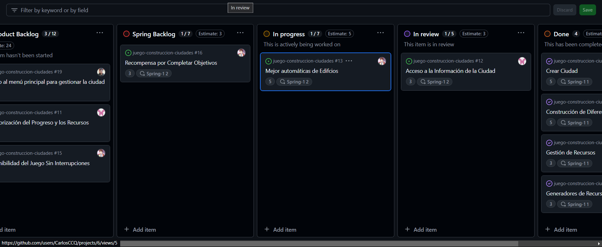

Nuestro pull request para la historia inicial ha sido aprobado, y el proceso de revisión se ha
completado. Ahora, se mueve la historia **Crear ciudad** de la columna Review a la columna Done.

Hemos completado el trabajo en la segunda y tercera historia y hemos hecho otro pull request. Movemos las historias **Generador de Recursos** y **Gestión de Recurso**  de la columna In Progress a la columna Review para solicitar una revisión, mientras que, ya esta en progeso la historia de usuario **Construcción de diferentes tipos de edificios**

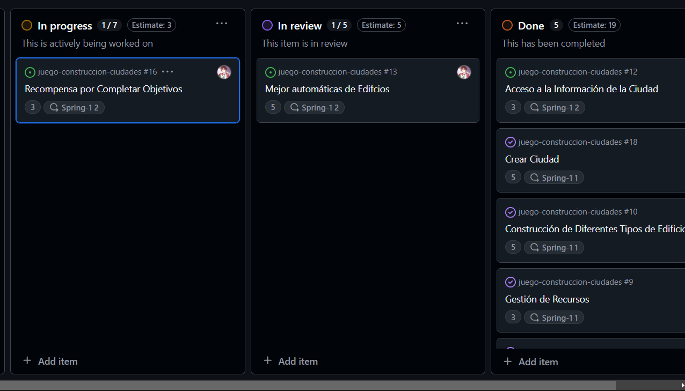

Nuestro pull request para las historias han sido aprobado, y el proceso de revisión se ha
completado. Ahora, se mueve las historias **Generador de Recursos** y **Gestión de Recurso** de la columna Review a la columna Done.

Hemos completado el trabajo en la 4 historia y hemos hecho otro pull request. Movemos la historia **Construcción de diferentes tipos de edificios** de la columna In Progress a la columna Review para solicitar una revisión.

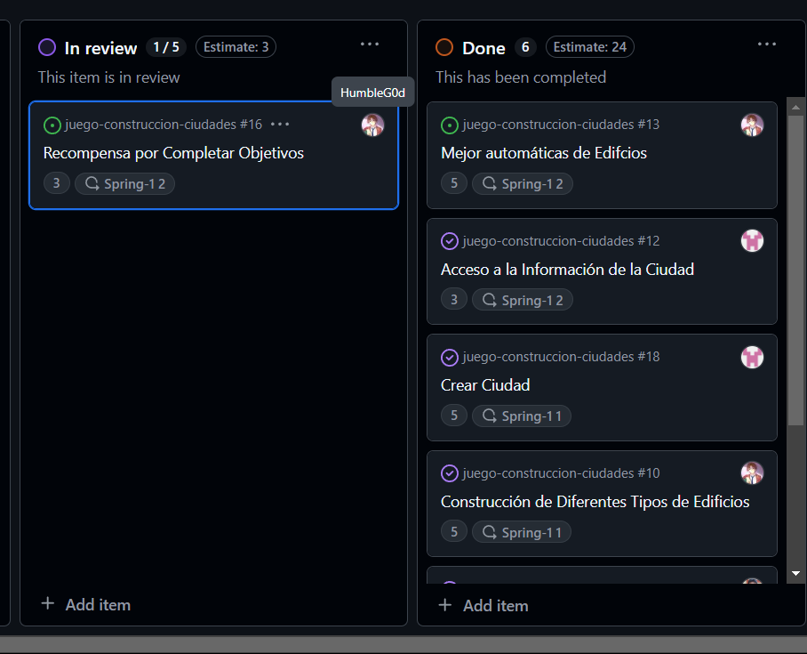

Nuestro pull request para la historia inicial ha sido aprobado, y el proceso de revisión se ha
completado. Ahora, se mueve la historia ***Construcción de diferentes tipos de edificios**  de la columna Review a la columna Done.

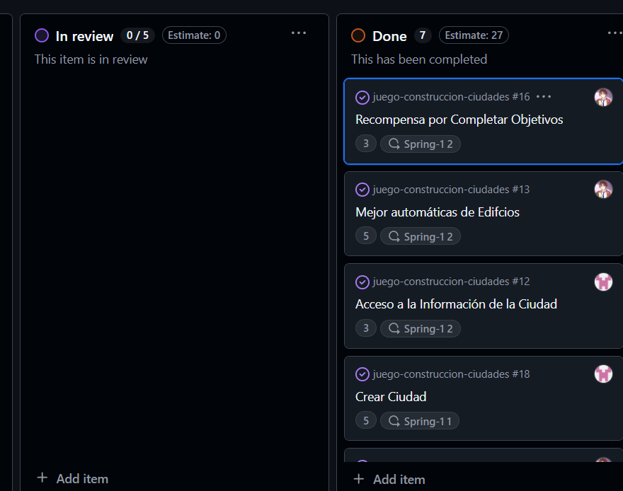

## 8. Configuracion del Burndown Char

Este grafico nos muestra la cantidad de historias de usuario que se le asigno a cada miembro y que perntencen al sprint1

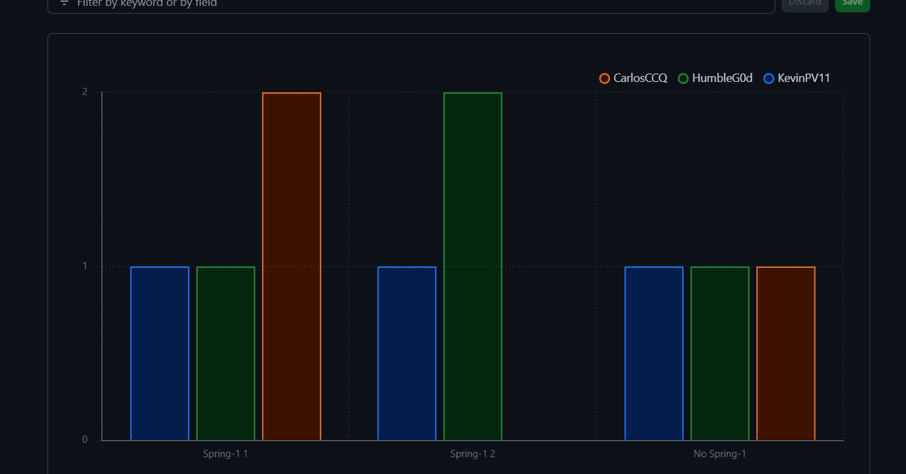

Finalmente este gráfico nos muestra la cantidad de historias de usuario que se le asigno a cada miembro que no pertenecen al Sprint 1

## 9. Inicio de pruebas de aceptación
Descripción de el proceso de pruebas de aceptación para verificar la correcta implementación de las funcionalidades de la aplicación. Utilizando **Cucumber** y **JUnit** para ejecutar las pruebas en base a historias de usuario, estas pruebas permiten garantizar que cada funcionalidad cumple con los requisitos establecidos.

### Entidades probadas:
- **Ciudad**: Representa una entidad que puede contener edificios y generadores de recursos.
- **Generador de Recursos**: Componentes que producen recursos para la ciudad.
- **Edificio**: Estructuras que pertenecen a la ciudad y pueden mejorarse para avanzar en el juego.

### Detalle de las pruebas

#### 1. CiudadSteps
Esta prueba valida la correcta manipulación y almacenamiento de las entidades de ciudad en el repositorio de datos.

#### Métodos de prueba:
Esta prueba valida la correcta manipulación y almacenamiento de las entidades de ciudad en el repositorio de datos.

```java
@SpringBootTest
public class CiudadSteps {

  @Autowired
  private CiudadService ciudadService;

  @Autowired
  private Genera_recursoService generaRecursoService;

  private CiudadDto ciudadDto;
  private List<Edificio> edificios = new ArrayList<>();
  private List<Genera_recursoDto> generadores = new ArrayList<>();

  private Ciudad convertirCiudadDtoACiudad(CiudadDto ciudadDto) {
    Ciudad ciudad = new Ciudad();
    ciudad.setId(ciudadDto.getId());
    ciudad.setNombre(ciudadDto.getNombre());

    return ciudad;
  }

  @Given("el jugador crea una ciudad llamada {string}")
  public void elJugadorCreaUnaCiudadLlamada(String nombreCiudad) {
    ciudadDto = new CiudadDto();
    ciudadDto.setNombre(nombreCiudad);
    ciudadDto = ciudadService.crearCiudad(ciudadDto);
    System.out.println("Ciudad creada: " + nombreCiudad);
  }

  @When("el jugador añade generadores de recursos y edificios a la ciudad")
  public void elJugadorAnadeGeneradoresDeRecursosYEdificiosALaCiudad() {

    Edificio edificio = new Edificio();
    edificio.setNombre("Edificio Principal");
    edificio.setTipoEdificio(Tipo_edificio.CLASE_BAJA);
    edificio.setCiudad(convertirCiudadDtoACiudad(ciudadDto));
    edificios.add(edificio);

    Genera_recursoDto generador = new Genera_recursoDto();
    generador.setTipoGeneradorRecurso(Tipo_generador_recurso.MINAS);
    generador.setCiudadId(ciudadDto.getId());
    generador.setTipoRecursoGenerado(Tipo_recurso.ORO);
    generadores.add(generador);

    generaRecursoService.crearGenerador(generador);
    System.out.println("Generadores y edificios añadidos a la ciudad.");
  }

  @Then("los generadores de recursos producen recursos")
  public void losGeneradoresDeRecursosProducenRecursos() {

    assertFalse(generadores.isEmpty(), "La ciudad debe tener generadores de recursos.");
    System.out.println("Los generadores están produciendo recursos.");
  }
}
```
## Entidades probadas:
- **Ciudad**: Representa la ubicación donde se añaden los edificios y desde donde se gestionan los recursos.
- **Edificio**: Elemento que puede ser construido en la ciudad si el jugador tiene los recursos necesarios.
- **Recurso**: Elemento necesario para construir edificios; se descuenta del inventario del jugador al realizar la construcción.

## Detalle de las Pruebas de Aceptación

### 2. CrearEdificioSteps

Este conjunto de pruebas asegura que el jugador solo puede construir un edificio si tiene los recursos necesarios y verifica que los recursos se descuenten correctamente.

#### Métodos de prueba:

```java
@SpringBootTest
public class CrearEdificioSteps {

  @Autowired
  private EdificioService edificioService;

  @Autowired
  private CiudadRepository ciudadRepository;

  @Autowired
  private RecursoRepository recursoRepository;

  private Ciudad ciudad;
  private Edificio edificio;
  private Map<Tipo_recurso, Integer> recursosDisponibles;
  private boolean construccionExitosa;
  private List<Edificio> edificios = new ArrayList<>();

  @Given("el jugador tiene suficientes recursos")
  public void el_jugador_tiene_suficientes_recursos() {
    ciudad = new Ciudad();
    ciudad.setNombre("Ciudad Test");

    recursosDisponibles = new HashMap<>();
    recursosDisponibles.put(Tipo_recurso.PIEDRA, 100);
    recursosDisponibles.put(Tipo_recurso.ORO, 100);
    recursosDisponibles.put(Tipo_recurso.AGUA, 100);

    List<Recurso> listaRecursos = new ArrayList<>();
    for (Map.Entry<Tipo_recurso, Integer> entry : recursosDisponibles.entrySet()) {
      listaRecursos.add(new Recurso(entry.getKey(), entry.getValue(), ciudad));
    }
    ciudad.setRecursos(listaRecursos);

    ciudadRepository.save(ciudad);
    listaRecursos.forEach(recurso -> recursoRepository.save(recurso));
  }

  @When("el jugador selecciona un tipo de edificio para construir")
  public void el_jugador_selecciona_un_tipo_de_edificio_para_construir() {
    edificio = new Edificio();
    edificio.setNombre("Casa");
    edificio.setTipoEdificio(Tipo_edificio.CLASE_BAJA);
    edificio.setCiudad(ciudad);

    Map<Tipo_recurso, Integer> costoEdificio = new HashMap<>();
    costoEdificio.put(Tipo_recurso.PIEDRA, 5);
    costoEdificio.put(Tipo_recurso.ORO, 2);
    costoEdificio.put(Tipo_recurso.AGUA, 1);
    edificio.setCosto(costoEdificio);
    edificios.add(edificio);
    ciudad.setEdificios(edificios);

    try {
      edificioService.crearEdificio(new EdificioDto(edificio.getNombre(), ciudad.getId(), Tipo_edificio.CLASE_BAJA, costoEdificio));
      construccionExitosa = true;
    } catch (Exception e) {
      construccionExitosa = false;
      throw new AssertionError("No se puede crear un edificio: " + e.getMessage());
    }
  }

  @Then("el edificio seleccionado se añade a la ciudad del jugador")
  public void el_edificio_seleccionado_se_añade_a_la_ciudad_del_jugador() {
    assertTrue(construccionExitosa);
    assertNotNull(ciudad.getEdificios());
    assertEquals("Casa", ciudad.getEdificios().get(0).getNombre());
  }

  @Then("los recursos necesarios para construir el edificio se descuentan del inventario del jugador")
  public void los_recursos_necesarios_para_construir_el_edificio_se_descuentan_del_inventario_del_jugador() {

    ciudad = ciudadRepository.findById(ciudad.getId()).orElseThrow(() -> new RuntimeException("Ciudad no encontrada"));

    for (Map.Entry<Tipo_recurso, Integer> entry : edificio.getCosto().entrySet()) {
      Tipo_recurso tipoRecurso = entry.getKey();
      int cantidadRequerida = entry.getValue();

      Recurso recurso = ciudad.getRecursos().stream()
              .filter(r -> r.getTipoRecursos() == tipoRecurso)
              .findFirst()
              .orElseThrow(() -> new RuntimeException("Recurso no encontrado en la ciudad"));

      int cantidadEsperada = recursosDisponibles.get(tipoRecurso) - cantidadRequerida;
      assertEquals("La cantidad del recurso " + tipoRecurso + " no se descontó correctamente",
              cantidadEsperada, recurso.getCantidad());
    }
  }
}
```

## Entidades probadas:
- **Ciudad**: Representa la ubicación donde se añaden y mejoran los edificios.
- **Edificio**: Elemento que puede ser mejorado al siguiente tipo o nivel si el jugador tiene los recursos necesarios.
- **Recurso**: Elemento necesario para mejorar edificios, que se verifica antes de proceder con la mejora.

## Detalle de las Pruebas de Aceptación

### 3. MejorarEdificioSteps

Este conjunto de pruebas asegura que el jugador solo puede mejorar un edificio si tiene los recursos necesarios y que, una vez realizada la mejora, el edificio pasa al siguiente tipo o nivel.

#### Métodos de prueba:

```java
@SpringBootTest
public class MejorarEdificioSteps {

  @Autowired
  private EdificioService edificioService;

  @Autowired
  private CiudadRepository ciudadRepository;

  @Autowired
  private EdificioRepository edificioRepository;

  @Autowired
  private RecursoRepository recursoRepository;

  private Ciudad ciudad;
  private Edificio edificio;
  private boolean mejoraExitosa;

  @Given("el jugador tiene un edificio de tipo {string}")
  public void el_jugador_tiene_un_edificio_de_tipo(String tipo) {
    ciudad = new Ciudad();
    ciudad.setNombre("Ciudad");
    ciudadRepository.save(ciudad);

    edificio = new Edificio();
    edificio.setNombre("Casa");
    edificio.setTipoEdificio(Tipo_edificio.fromString(tipo));
    edificio.setCiudad(ciudad);
    edificioRepository.save(edificio);
  }

  @Given("el jugador tiene suficientes recursos para mejorar")
  public void el_jugador_tiene_suficientes_recursos_para_mejorar() {
    recursoRepository.save(new Recurso(Tipo_recurso.PIEDRA, 20, ciudad));
    recursoRepository.save(new Recurso(Tipo_recurso.ORO, 10, ciudad));
    recursoRepository.save(new Recurso(Tipo_recurso.AGUA, 5, ciudad));
  }

  @When("el sistema verifica los recursos disponibles")
  public void el_sistema_verifica_los_recursos_disponibles() {
    mejoraExitosa = edificioService.mejorarEdificio(edificio.getId());
  }

  @Then("el edificio se mejora al siguiente nivel o tipo")
  public void el_edificio_se_mejora_al_siguiente_nivel_o_tipo() {
    Edificio edificioActualizado = edificioRepository.findById(edificio.getId()).orElse(null);

    assertNotNull(edificioActualizado);
    assertTrue(mejoraExitosa);
    assertEquals(Tipo_edificio.CLASE_MEDIA, edificioActualizado.getTipoEdificio());
  }
}
```

## Entidades probadas:
- **Ciudad**: Representa la ciudad del jugador, que sube de nivel y recibe recompensas al cumplir los objetivos.
- **Edificio**: Elemento que se cuenta como parte del progreso de la ciudad para alcanzar un objetivo específico.
- **Recurso**: Recompensa que se otorga al jugador en caso de cumplir el objetivo establecido de edificios.

## Detalle de las Pruebas de Aceptación

### 4. RecompensaSteps

Este conjunto de pruebas asegura que el jugador recibe una recompensa en recursos adicionales y que la ciudad sube de nivel cuando el jugador cumple el objetivo de construir un número específico de edificios.

#### Métodos de prueba:

```java

@SpringBootTest
public class RecompensaSteps {

  @Autowired
  private CiudadService ciudadService;

  @Autowired
  private CiudadRepository ciudadRepository;

  @Autowired
  private EdificioRepository edificioRepository;

  @Autowired
  private RecursoRepository recursoRepository;

  private Ciudad ciudad;
  private boolean objetivoAlcanzado;

  @Given("el jugador tiene una ciudad con un nivel actual de {int}")
  public void el_jugador_tiene_una_ciudad_con_un_nivel_actual_de(int nivelInicial) {
    ciudad = new Ciudad();
    ciudad.setNombre("Ciudad de Prueba");
    ciudad.setNivel(nivelInicial);
    ciudadRepository.save(ciudad);
  }

  @Given("el jugador ha construido {int} edificios")
  public void el_jugador_ha_construido_edificios(int numeroEdificios) {
    for (int i = 0; i < numeroEdificios; i++) {
      Edificio edificio = new Edificio();
      edificio.setNombre("Edificio " + i);
      edificio.setCiudad(ciudad);
      edificio.setTipoEdificio(Tipo_edificio.CLASE_BAJA);
      edificioRepository.save(edificio);
    }
    ciudad.setEdificios(edificioRepository.findByCiudad(ciudad));
  }

  @When("el sistema detecta que el jugador ha alcanzado el objetivo de {int} edificios")
  public void el_sistema_detecta_que_el_jugador_ha_alcanzado_el_objetivo_de_edificios(int objetivoEdificios) {
    objetivoAlcanzado = ciudadService.verificarYSubirNivelCiudad(ciudad.getId(), objetivoEdificios);
  }

  @Then("la ciudad sube al nivel {int}")
  public void la_ciudad_sube_al_nivel(int nivelEsperado) {
    Ciudad ciudadActualizada = ciudadRepository.findById(ciudad.getId()).orElseThrow();
    assertTrue(objetivoAlcanzado);
    assertEquals(nivelEsperado, ciudadActualizada.getNivel());
  }

  @Then("el jugador recibe una recompensa de {int} unidades adicionales de cada recurso")
  public void el_jugador_recibe_una_recompensa_de_unidades_adicionales_de_cada_recurso(int unidadesRecompensa) {
    List<Recurso> recursos = recursoRepository.findByCiudad(ciudad);

    for (Recurso recurso : recursos) {
      int cantidadEsperada = recurso.getCantidad() + unidadesRecompensa;
      assertEquals(cantidadEsperada, recurso.getCantidad());
    }
  }
}
```

### Herramientas utilizadas:

- **JUnit 5** para la ejecución de pruebas unitarias.
- **AssertJ** para las aserciones en las pruebas.
- **Spring Boot Test** para el manejo de la configuración de pruebas y la base de datos en memoria H2.

## 10. Configuración inicial de CI/CD

Durante este sprint, se implementó un pipeline de CI/CD utilizando **GitHub Actions** para automatizar tareas clave en el proceso de desarrollo del proyecto. El pipeline abarca desde la compilación del código, la ejecución de pruebas unitarias, la construcción del backend, hasta la creación de una imagen Docker.

### Descripción del Pipeline

El archivo `backend.yml` ubicado en el directorio `.github/workflows/` define el pipeline de CI/CD. Este pipeline es ejecutado automáticamente en los siguientes casos:
- **Branches monitoreados**: `feature/sprint-2`, `develop`, y `main`.
- **Archivos monitoreados**: `sprint-1/docker-compose.yml` y `.github/workflows/backend.yml`.

### Estructura del Pipeline

1. **Jobs Definidos**:
   El pipeline incluye varios jobs que se ejecutan en el sistema operativo **Ubuntu-latest**:

    - **Compile**: Compila el proyecto utilizando **Maven** y **JDK 17**.
    - **Unit Tests**: Ejecuta las pruebas unitarias usando **JUnit** y Maven, asegurando que el código funcione correctamente.
    - **Build Backend**: Compila y construye el backend del proyecto.
    - **Build Docker Image**: Crea la imagen Docker del proyecto para facilitar su despliegue.

### Detalles de los Jobs:

#### 1. Compile
- **Propósito**: Compilar el código del proyecto.
- **Pasos**:
    - Clonar el repositorio.
    - Configurar **JDK 17** usando **Temurin**.
    - Otorgar permisos ejecutables al script `mvnw`.
    - Compilar el proyecto.

#### 2. Unit Tests
- **Propósito**: Ejecutar las pruebas unitarias del proyecto.
- **Pasos**:
    - Clonar el repositorio.
    - Configurar **JDK 17**.
    - Otorgar permisos ejecutables al script `mvnw`.
    - Ejecutar las pruebas unitarias para validar que los componentes clave funcionan como se espera.

#### 3. Build Backend
- **Propósito**: Compilar y construir el backend del proyecto.
- **Dependencias**: Este job depende de que los jobs `compile` y `unit-tests` se ejecuten correctamente.
- **Pasos**:
    - Clonar el repositorio.
    - Configurar **JDK 17**.
    - Otorgar permisos ejecutables al script `mvnw`.
    - Ejecutar la construcción del proyecto backend.

#### 4. Build Docker Image
- **Propósito**: Construir la imagen Docker del proyecto.
- **Dependencias**: Este job depende de que el job `build` se haya completado exitosamente.
- **Pasos**:
    - Clonar el repositorio.
    - Configurar **JDK 17**.
    - Otorgar permisos ejecutables al script `mvnw`.
    - Construir la imagen Docker a partir del proyecto backend.

### Código YAML del Pipeline

A continuación, se muestra el código YAML utilizado para configurar el pipeline de CI/CD en GitHub Actions:

```yaml
services:
  postgres:
    container_name: postgres-sql
    image: postgres
    env_file:
      - .env 
    ports:
      - "1234:5432"  
    volumes:
      - postgres:/var/lib/postgres/data 
    networks:
      - spring-boot-net  

  citybuildinggame:
    container_name: city_game
    image: city_game 
    ports:
      - "8081:8081"  
    networks:
      - spring-boot-net 
    depends_on:
      - postgres  
    stdin_open: true
    tty: true
  prometheus:
    image: "prom/prometheus"
    restart: unless-stopped  
    networks:
      - spring-boot-net  
    ports:
      - "9090:9090"  
    volumes:
      - ./prometheus.yml:/etc/prometheus/prometheus.yml 
    depends_on:
      - citybuildinggame  

  grafana:
    image: "grafana/grafana-enterprise"
    restart: unless-stopped  
    networks:
      - spring-boot-net 
    ports:
      - "3000:3000"  
      - prometheus:prometheus  

volumes:
  postgres:  
networks:
  spring-boot-net:
    driver: bridge  #
```


### Monitoreo con Prometheus y Grafana
#### Accediendo a Prometheus

- Una vez que todos los contenedores estén corriendo, puedes acceder a la interfaz web de Prometheus en:

    ```
    http://localhost:9090
    ```
    
    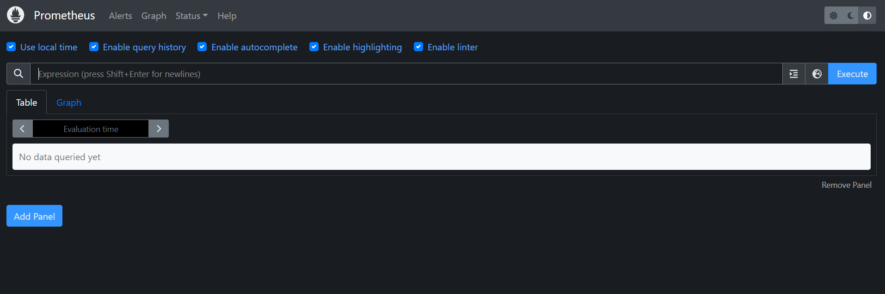

- En la interfaz de Prometheus, puedes hacer consultas sobre las métricas recolectadas. Por ejemplo:
  - Consulta todas las métricas recolectadas: `up`
  - Métricas sobre el uso de CPU: `process_cpu_seconds_total`
  - Métricas sobre el estado de tus endpoints: `http_requests_total`

  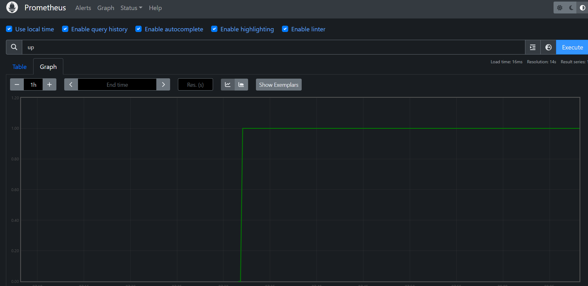

- También puedes ver el estado de las series de tiempo, targets y alertas.

### Accediendo a Grafana

- Grafana estará disponible en el puerto `3000` por defecto. Accede a Grafana desde tu navegador:

    ```
    http://localhost:3000
    ```

2. Las credenciales por defecto son:
  - **Usuario**: `admin`
  - **Contraseña**: `admin`

   Se te pedirá cambiar la contraseña la primera vez que inicies sesión.

  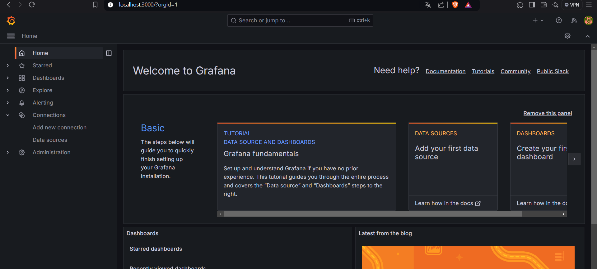

  

- Una vez dentro de Grafana:
  - Ve a la sección de **Configuration** y selecciona **Data Sources**.
  - Agrega **Prometheus** como una fuente de datos usando la siguiente URL para conectarlo:

    ```
    http://prometheus:9090
    ```
  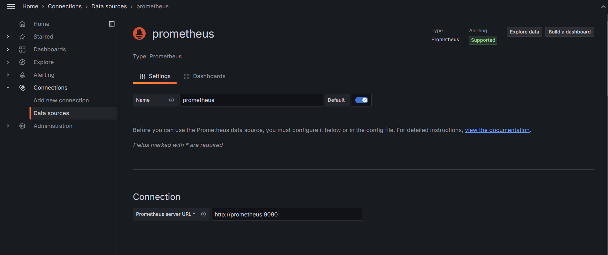


- Crea un dashboard para visualizar las métricas:
  - Ve a **Create** > **Dashboard**.
  - Selecciona **Add a new panel** y en la sección de **Data source**, selecciona **Prometheus**.
  - Escribe una consulta para mostrar una métrica (por ejemplo, `http_requests_total`).
  - Guarda el panel y agrégalo a un dashboard.

  
  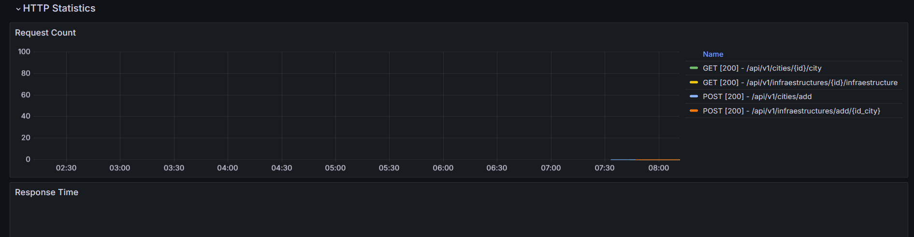

  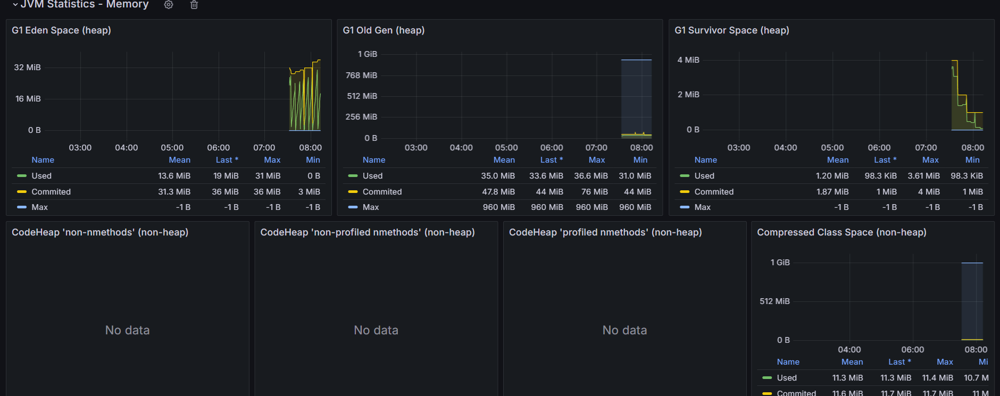
  

## 11. Conclusiones del Sprint 1: Construcción de Ciudades

### 1. Progreso general

Durante el Sprint 2, se completaron las tareas clave relacionadas con la construcción de la infraestructura del proyecto y las funcionalidades básicas necesarias para el sistema de ciudades. Esto incluyó la creación de un tablero Kanban en GitHub para gestionar el progreso, la escritura de historias de usuario, la implementación de la lógica de construcción de ciudades y la gestión de recursos, además de la configuración inicial del pipeline de CI/CD y las pruebas unitarias.

### 2. Cumplimiento de objetivos

Los principales objetivos del Sprint 2 fueron cumplidos con éxito:

- Refinamiento del backlog y ajustes en el plan de sprint.
- Implementación de funcionalidades avanzadas.
- Desarrollo de pruebas automatizadas con Behave o Cucumber.
- Configuración de Prometheus y Grafana.
- Uso de comandos avanzados de Git durante el desarrollo.

### 3. Implementación técnica

Las funcionalidades implementadas en este sprint establecen una base sólida para el sistema:
- **Creación de ciudades**: Los jugadores pueden crear ciudades y asignar nombres.
- **Construcción de edificios y generación de recursos**: Los jugadores ahora pueden construir varios tipos de edificios y asignar generadores de recursos a sus ciudades, lo que permite el crecimiento y la expansión.
- **Gestión de recursos**: Se añadió una lógica para gestionar los recursos en la ciudad, como madera, piedra y oro, permitiendo la construcción de infraestructuras adicionales.

### 4. Calidad del código y pruebas

Se iniciaron pruebas unitarias utilizando JUnit para asegurar el correcto funcionamiento de las funcionalidades implementadas. Estas pruebas ayudaron a verificar que los componentes clave, como las entidades de ciudad, edificios, recursos y generadores de recursos, funcionen correctamente y estén correctamente asociados entre sí.

#### Estado de las pruebas:
- Todas las pruebas se ejecutaron correctamente, validando que los componentes principales del sistema estén bien implementados.
- Las pruebas garantizaron la estabilidad del sistema ante los escenarios básicos, como la creación de ciudades y la gestión de recursos.

### 5. Mejora continua

A lo largo del Sprint 2, se identificaron algunas áreas de mejora técnica (deuda técnica), como la gestión avanzada de recursos y la optimización del sistema de generación de recursos. Estas áreas han sido etiquetadas como **technical debt** y serán abordadas en futuros sprints para evitar que afecten el rendimiento del sistema a largo plazo.

### 6. Revisión de prioridades y próximas acciones

Se asignaron prioridades altas a las historias de usuario más críticas, como la creación de ciudades y la gestión de recursos. Esto permitió que el equipo se centrara en las tareas que ofrecen el mayor valor para el desarrollo del proyecto en esta fase inicial. Las funcionalidades restantes serán implementadas en los próximos sprints, asegurando una progresión ordenada del desarrollo.

