# Construccion de ciudades Sprint 1

## 1. Configuración inicial del tablero Kanban y el Product Backlog

- **Tablero Kanban**: Se creó el tablero Kanban en GitHub para gestionar y visualizar el progreso del Sprint 1. El tablero contiene las siguientes columnas:
  - **Backlog**: Todas las tareas que aún no han sido trabajadas.
  - **In Progress**: Tareas que están siendo implementadas.
  - **In Review**: Tareas listas para ser revisadas.
  - **Done**: Tareas completadas.
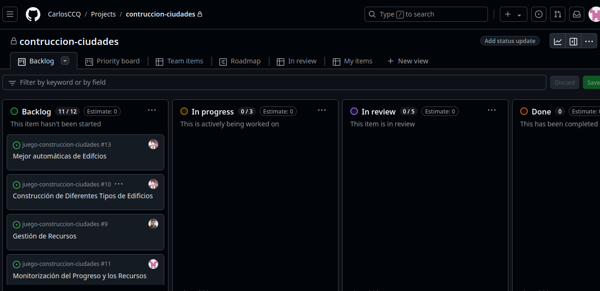

 - Historias clave para el Sprint 1:
    - **Crear Ciudad.**
    - **Construcción de Diferentes Tipos de Edificios.**
    - **Gestión de Recursos.**
    - **Generadores de Recursos**

## 2. Historias de usuario con criterios de aceptación en Gherkin

Se escribieron las historias de usuario utilizando la sintaxis Gherkin para facilitar la definición clara de criterios de aceptación.

### Se crearon las siguientes historias de usuario

**Historia de Usuario 1: Crear Ciudad**

- **As a** jugador**As a** jugador
- **I need** crear una ciudad para que contenga tanto edificios como generadores de recursos
- **So that** pueda producir los recursos necesarios para expandir mi ciudad y construir más infraestructuras

### Details and Assumptions
* Al crear una ciudad, el jugador debe poder añadir tanto edificios como generadores de recursos.
* Los generadores de recursos deben contribuir a la producción total de la ciudad.

```gherkin
Given el jugador está creando una nueva ciudad
When el jugador añade generadores de recursos y edificios a la ciudad
Then los generadores de recursos producen materiales
```
**Historia de Usuario 2: Construcción de Diferentes Tipos de Edificios**

- **As a** jugador
- **I need** construir diferentes tipos de edificios
- **So that** desarrollar mi ciudad con una variedad de infraestructuras

### Details and Assumptions
* Los jugadores deben tener acceso a varios tipos de edificios,  cada uno con diferentes niveles de estatus
* Los costos de construcción pueden variar según el tipo de edificio.

```gherkin
Given el jugador tiene suficientes recursos,
When el jugador selecciona un tipo de edificio para construir,
Then el edificio seleccionado se añade a la ciudad del jugador,
And los recursos necesarios para construir el edificio se descuentan del inventario del jugador.
And el tiempo de construcción correspondiente se comienza a contar.
And el jugador recibe una notificación de que el edificio está en proceso de construcción.
```

**Historia de Usuario 3: Gestión de Recursos**

- **As a** jugador
- **I need** gestionar mis recursos (madera,        piedra, oro)
- **So that** puedo construir diferentes tipos de edificios en mi ciudad y optimizar el crecimiento

### Details and Assumptions
* Los jugadores deben poder ver y manejar sus recursos.
* Los recursos deben ser limitados y afectarán las decisiones de construcción.

```gherkin
Given el jugador tiene una cantidad inicial de recursos
When el jugador asigna recursos para construir un edificio
Then los recursos asignados se deducen de la cantidad disponible
```

**Historia de Usuario 4: Generadores de Recursos**

- **As a** jugador 
- **I need** asignarle generadores de recursos a mi ciudad
- **So that** mi ciudad pueda desarrollarse de manera mas rapida

### Details and Assumptions
* Los recursos en la ciudad son generados periódicamente de manera aleatoria por los generadores de recursos
* El crecimiento de mi ciudad depende de la correcta gestión de los recursos

```gherkin
Given el jugador a construido una ciudad
When el jugador revisa las condiciones de su ciudad
Then visualizara los generadores de recursos asignados
```

En cada historia de usuario se empleo el siguiente template:
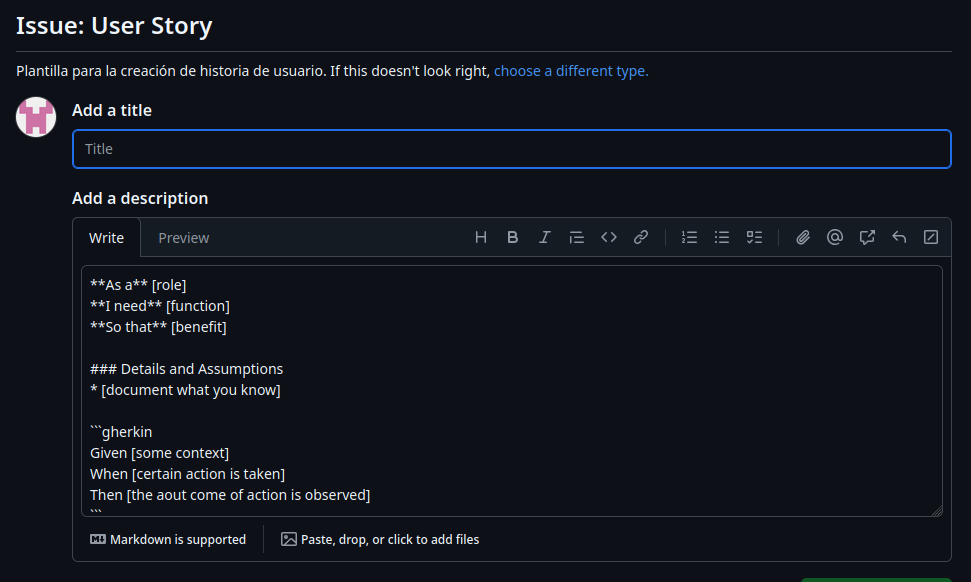

## 3. Labels sugeridos y su uso

Se crearon algunos labels para luego asignarlos a cada historia de usuario, segun sus características y funcionalidad

### 1. Segun su Prioridad

- **high priority**: Para indicar que una historia de usuario o tarea es de alta prioridad.
- **medium priority**: Para elementos de prioridad media.
- **low priority**: Para ítems que no requieren atención inmediata.

### 2. Segun su tipo de tarea

- **enhancement**: Etiqueta para mejoras solicitadas o nuevas características que se desean agregar al proyecto. Se usa para separar las mejoras o nuevas funcionalidades de los problemas existentes.
- **ci/cd**: Para elementos de prioridad media.
- **technical debt**: Para marcar aquellas historias que no aportan valor visible al cliente pero deben completarse para continuar con el desarrollo.

## 4. Añadir labels a las historias

Procederemos a etiquetar cada historia de usuario con su label correspondiente , segun su funcionalidad y función.


**Historia de Usuario 1: Crear Ciudad**

- **Label:** ```high priority```
- **Justificación:** Es una función central del juego, ya que sin esta característica, los jugadores no podrán interactuar con el núcleo del sistema.
- **Label:** ```enhancement```
- **Justificación:** a capacidad de crear una ciudad con edificios y generadores de recursos es una funcionalidad nueva que mejorará la experiencia de juego.

**Historia de Usuario 2: Construcción de Diferentes Tipos de Edificios**

- **Label:** ```high priority```
- **Justificación:** Los edificios son un componente clave del juego y son necesarios para expandir la ciudad y gestionar mejor los recursos.
- **Label:** ```feature```
- **Justificación:** Es una nueva funcionalidad que permite a los jugadores construir edificios. A diferencia de un bug o mejora, esto es una parte clave del juego que debe implementarse desde ceros.

**Historia de Usuario 3: Gestión de Recursos**

- **Label:** ```high priority```
- **Justificación:** La gestión de recursos es fundamental para la jugabilidad y el progreso del jugador.
- **Label:** ```technical debt```
- **Justificación:** porque, aunque la implementación de la gestión de recursos es funcional, contiene aspectos que, si no se abordan, podrían generar problemas más graves en el futuro..

**Historia de Usuario 4: Generadores de Recursos**

- **Label:** ```high priority```
- **Justificación:** Sin ellos, los jugadores no podrán aumentar los recursos necesarios para la expansión y construcción de nuevas infraestructuras.
- **Label:** ```technical debt```
- **Justificación:** bordar esta deuda técnica a tiempo evitará que se acumulen complicaciones que afecten el desarrollo continuo y el rendimiento del sistema a largo plazo.

## 5. Asignación de puntos de historia

Para asignar puntos de historia a cada una de las historias de usuario del proyecto, tomaremos en cuenta la **complejidad**, el **esfuerzo** requerido y la **incertidumbre**. Utilizaré la **secuencia de Fibonacci** (1, 2, 3, 5, 8, 13, etc.) como referencia, donde:

- **1 punto**: Historia muy simple, poca o ninguna complejidad.
- **2 puntos**: Relativamente sencilla, con poco esfuerzo o complejidad.
- **3 puntos**: Moderada complejidad, requerirá más esfuerzo pero no demasiada incertidumbre.
- **5 puntos**: Historia compleja, con más trabajo y algún nivel de incertidumbre.
- **8 puntos**: Historia con mucha complejidad o incertidumbre, que requerirá un esfuerzo considerable.
- **13 puntos**: Historia muy compleja con alta incertidumbre, probablemente requiera bastante investigación.

**Historia de Usuario 1: Crear Ciudad**

- **Puntos de historia :** ```5```
- **Justificación:** La creación de una ciudad que contenga tanto edificios como generadores de recursos requiere integrar varias funcionalidades del juego. Esto incluye la construcción de infraestructuras y la generación continua de recursos, ambos necesarios para la expansión de la ciudad. La complejidad es moderada, ya que implica coordinar la interacción entre estos elementos, asegurando que los recursos se produzcan y utilicen correctamente para el crecimiento del juego.

**Historia de Usuario 2: Construcción de Diferentes Tipos de Edificios**

- **Puntos de historia :** ```5```
- **Justificación:** a construcción de edificios implica más esfuerzo ya que necesita integrar la lógica de asignación de recursos, el manejo de tiempos de construcción, la visualización de los edificios y su impacto en la ciudad. La complejidad es mayor que la de la gestión de recursos, debido a las dependencias entre los recursos y los edificios.

**Historia de Usuario 3: Gestión de Recursos**

- **Puntos de historia :** ```3```
- **Justificación:** La gestión de recursos es clave en el juego y requiere establecer una lógica para la asignación, deducción y visualización en tiempo real. Aunque no tiene mucha incertidumbre, tiene una complejidad moderada, ya que debe integrar varios tipos de recursos.


**Historia de Usuario 4: Generadores de Recursos**

- **Puntos de historia :** ```5```
- **Justificación:** La funcionalidad de asignar generadores de recursos a una ciudad es relativamente simple en comparación con otras historias de usuario más complejas. Aunque los generadores de recursos producen materiales de manera periódica, su implementación no requiere una lógica demasiado intrincada. La mayor parte del trabajo consiste en asignar correctamente los generadores a la ciudad y mostrar visualmente su estado al jugador.

## 6. Asignación de miembros a cada historia de usuario

Nos hemos asignado cada historia de usario de acuerdo a el conocimiento y la capacidad de cada uno, siendo asi la creacion de ramas especificas para cada entidad, en este caso **ciudad**, **recursos** y **edificios**

- **Crear Ciudad.** Kevin Palomino
- **Construcción de Diferentes Tipos de Edificios.** Sergio Gil
- **Gestión de Recursos.** Carlos Canto
- **Generadores de Recursos** Carlos Canto

## 7. Configuración de Sprints y reacion del Spring Blacklog y

Se introduce **"Sprint1"** como el nombre del campo, eligimos **"Iteration"** como el tipo de campo. Mantenmos la duración en una semana

Luego de asginar los puntos de historia estimados y un sprint, y moveremos las historias del Product Backlog al Sprint Backlog para construir nuestro plan.


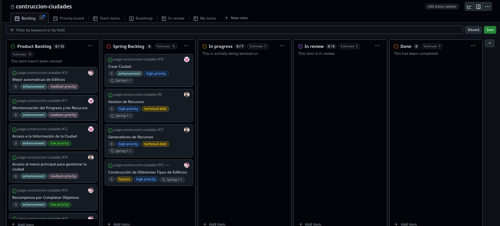


Ahora movemos que ya nos asignamos moveremos a la columna In progress para que se de a conocer que ya se esta trabandoesa historia de usuario en dicha rama.

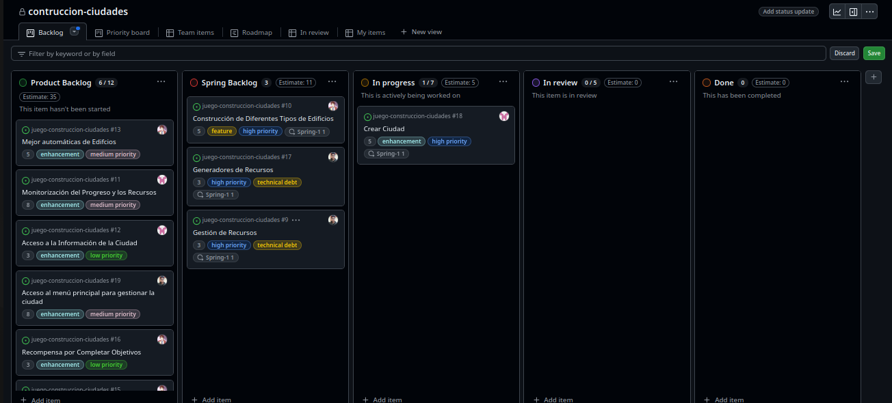

Una vez que se termine de trabajar en la historia, es momento de solicitar una revisión.
Si se registrasto código en GitHub, este es el paso donde se haría un pull request para fusionar el código en la rama main. Movemos la historia de In Progress a Review.

Mientras se espera una revisión, se comienza a trabajar en otra historia. Tomamos la
siguiente historia de la parte superior del Sprint Backlog

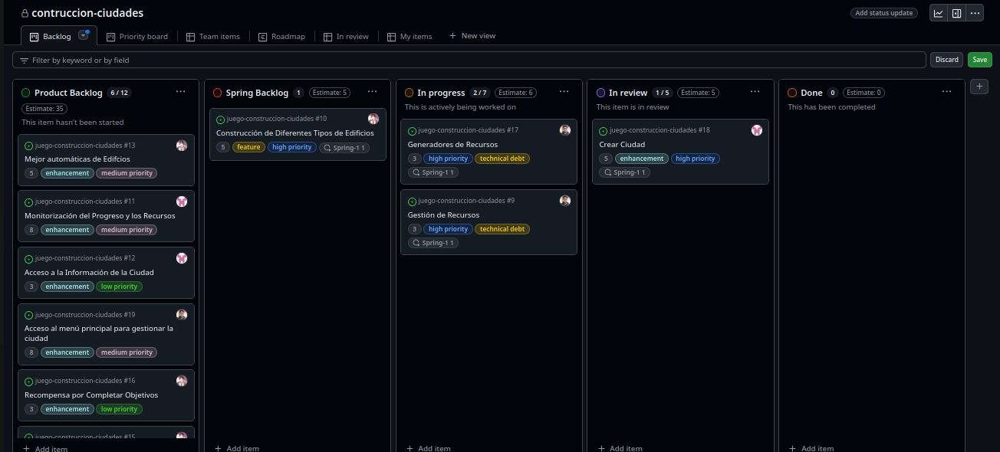

Nuestro pull request para la historia inicial ha sido aprobado, y el proceso de revisión se ha
completado. Ahora, se mueve la historia **Crear ciudad** de la columna Review a la columna Done.

Hemos completado el trabajo en la segunda y tercera historia y hemos hecho otro pull request. Movemos las historias **Generador de Recursos** y **Gestión de Recurso**  de la columna In Progress a la columna Review para solicitar una revisión, mientras que, ya esta en progeso la historia de usuario **Construcción de diferentes tipos de edificios**

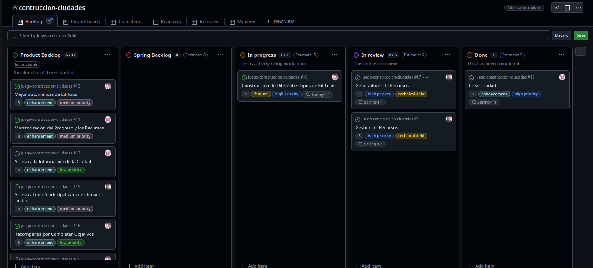

Nuestro pull request para las historias han sido aprobado, y el proceso de revisión se ha
completado. Ahora, se mueve las historias **Generador de Recursos** y **Gestión de Recurso** de la columna Review a la columna Done.

Hemos completado el trabajo en la 4 historia y hemos hecho otro pull request. Movemos la historia **Construcción de diferentes tipos de edificios** de la columna In Progress a la columna Review para solicitar una revisión.

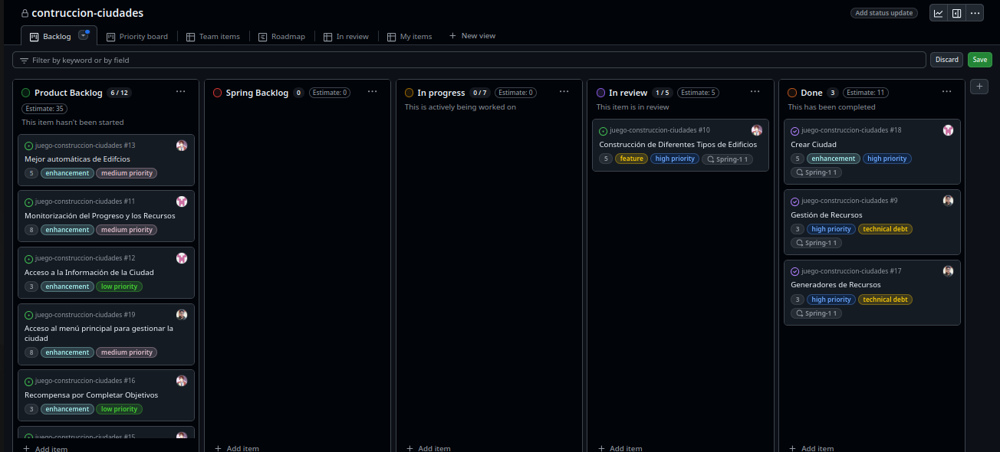

Nuestro pull request para la historia inicial ha sido aprobado, y el proceso de revisión se ha
completado. Ahora, se mueve la historia ***Construcción de diferentes tipos de edificios**  de la columna Review a la columna Done.

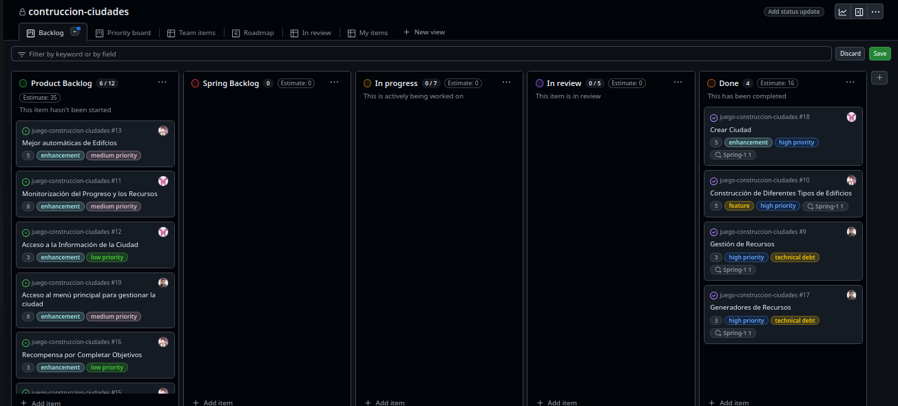

## 8. Configuracion del Burndown Char

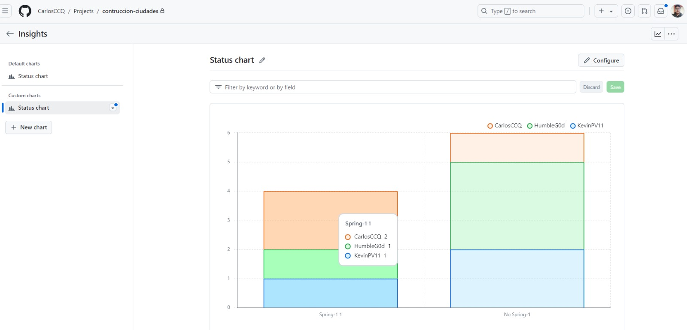

Este grafico nos muestra la cantidad de historias de usuario que se le asigno a cada miembro y que perntencen al sprint1

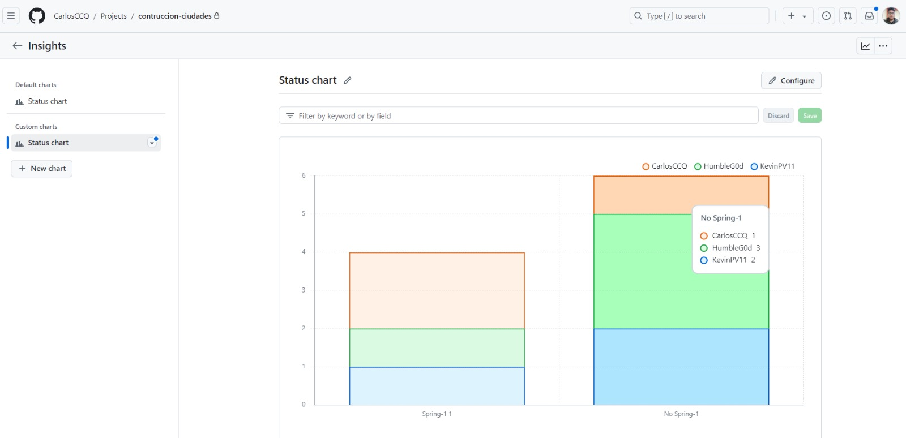

Finalmente este gráfico nos muestra la cantidad de historias de usuario que se le asigno a cada miembro que no pertenecen al Sprint 1

## 9. Inicio de pruebas unitarias para componentes clave


En este sprint, se desarrollaron pruebas unitarias utilizando **JUnit** para asegurar el correcto funcionamiento de los componentes clave del proyecto. Las pruebas se centraron en las entidades más importantes del sistema dentro de la carpeta `repository`, tales como la **Ciudad**, **Edificio**, **Generador de Recursos** y **Recurso**. Las pruebas se llevaron a cabo utilizando una base de datos en memoria **H2** y el framework de pruebas de **Spring Boot**.

### Entidades probadas:
1. **Ciudad** (`CiudadRepositoryTest`)
2. **Edificio** (`EdificioRepositoryTest`)
3. **Generador de Recursos** (`GeneraRecursoRepositoryTest`)
4. **Recurso** (`RecursoRepositoryTest`)

### Detalle de las pruebas unitarias

#### 1. CiudadRepositoryTest
Este conjunto de pruebas verifica la funcionalidad básica de la entidad **Ciudad**.
- **Configuración inicial**: Se crean dos ciudades, "Ciudad Lima" y "Ciudad Arequipa", y se almacenan en la base de datos en memoria.
  
##### Métodos de prueba:
- **testFindByNombre**: Verifica que la ciudad se pueda buscar correctamente por nombre. Si se busca "Ciudad Lima", debe devolver la ciudad correctamente.
- **testFindByNombreNotFound**: Prueba el comportamiento al buscar una ciudad que no existe en la base de datos, en este caso "Ciudad Cusco", y asegura que la lista de resultados esté vacía.

```java
@Test
public void testFindByNombre() {
    List<Ciudad> ciudades = ciudadRepository.findByNombre("Ciudad Lima");
    assertEquals(1, ciudades.size());
    assertEquals("Ciudad Lima", ciudades.get(0).getNombre());
}

@Test
public void testFindByNombreNotFound() {
    List<Ciudad> ciudades = ciudadRepository.findByNombre("Ciudad Cusco");
    assertTrue(ciudades.isEmpty());
}
```
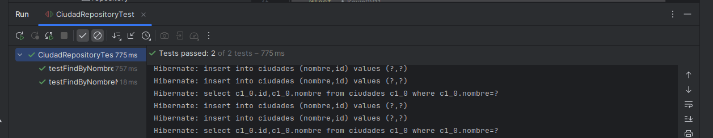

#### 2. EdificioRepositoryTest
En estas pruebas, se verifica la correcta creación y almacenamiento de edificios en la base de datos, así como la asociación de estos con una ciudad específica.
  
##### Métodos de prueba:
- **tdificio_repository_guardar_edificio**: Verifica que un edificio se pueda guardar correctamente en la base de datos y que los datos del edificio guardado coincidan con los valores iniciales. El test asegura que el edificio se haya asociado a la ciudad correcta y que su nombre se haya guardado correctamente.

```java
@Test
void edificio_repository_guardar_edificio(){
    Edificio edificio = Edificio.builder().nombre("Edificio de prueba").ciudad(ciudad).tipoEdificio(Tipo_edificio.CLASE_BAJA).build();
    edificioRepository.save(edificio);
    
    Edificio edificio_guardado = edificioRepository.findById(edificio.getId()).get();
    Assertions.assertThat(edificio_guardado.getNombre()).isEqualTo(edificio.getNombre());
}

```
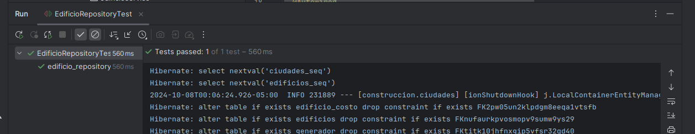

#### 3. GeneraRecursoRepositoryTest
Este conjunto de pruebas valida que los generadores de recursos puedan asociarse correctamente a las ciudades y generar recursos específicos.
  
##### Métodos de prueba:
- **testFindByCiudad**: Verifica que los generadores de recursos se puedan buscar correctamente por ciudad y que se devuelva la lista adecuada de generadores asociados a una ciudad específica. En este caso, se prueban dos generadores de recursos asociados a "CiudadTest".

```java
@Test
public void testFindByCiudad(){
    List<Genera_recuso> recursos = generaRecursoRepository.findByCiudad(ciudad);

    assertThat(recursos).isNotEmpty();
    assertThat(recursos).hasSize(2);
    assertThat(recursos.get(0).getCiudad()).isEqualTo(ciudad);
    assertThat(recursos.get(0).getTipoGeneradorRecurso()).isEqualTo(Tipo_generador_recurso.CANTERAS);
    assertThat(recursos.get(1).getTipoGeneradorRecurso()).isEqualTo(Tipo_generador_recurso.MINAS);
}

```
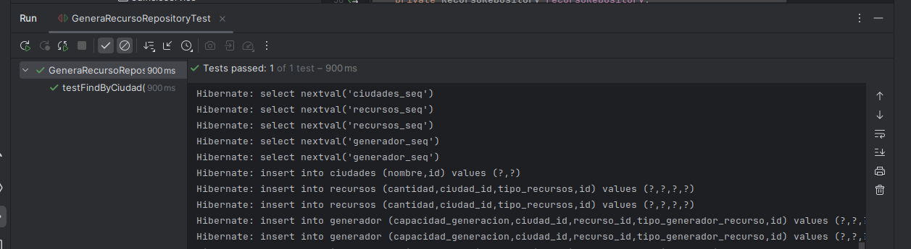

#### 4. RecursoRepositoryTest
Este conjunto de pruebas asegura que los recursos generados en una ciudad se gestionen y almacenen correctamente. Se comprueba la asociación de los recursos con las ciudades y su búsqueda por tipo.
  
##### Métodos de prueba:
- **testFindByTipoRecursoAndCiudad**: Verifica que un recurso específico (por ejemplo, oro) se pueda buscar correctamente por tipo y ciudad. Asegura que el recurso de tipo oro asociado a "CiudadTest" esté correctamente almacenado con la cantidad esperada.
- **testFindByTipoRecursos**: Valida que los recursos se puedan buscar por tipo (oro o piedra) y que se devuelvan los valores correctos.

```java
@Test
public void testFindByTipoRecursoAndCiudad(){
    List<Recurso> recursos = recursoRepository.findByTipoRecursosAndCiudad(Tipo_recurso.ORO, ciudad);
    assertThat(recursos).isNotEmpty();
    assertThat(recursos.get(0).getTipoRecursos()).isEqualTo(Tipo_recurso.ORO);
    assertThat(recursos.get(0).getCantidad()).isEqualTo(100);
}

@Test
public void testFindByTipoRecursos(){
    List<Recurso> recursosOro = recursoRepository.findByTipoRecursos(Tipo_recurso.ORO);
    List<Recurso> recursosPiedra = recursoRepository.findByTipoRecursos(Tipo_recurso.PIEDRA);
    
    assertThat(recursosOro).hasSize(1);
    assertThat(recursosOro.get(0).getCantidad()).isEqualTo(100);
    assertThat(recursosPiedra.get(0).getCantidad()).isEqualTo(200);
}

```
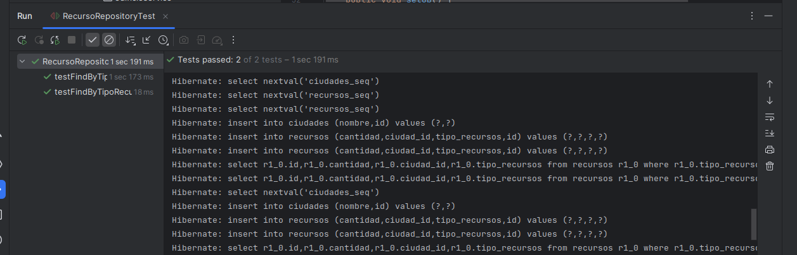

### Estado de las pruebas:
- Todas las pruebas unitarias de los componentes clave se ejecutaron correctamente y validaron las funcionalidades críticas de las entidades de **Ciudad**, **Edificio**, **Generador de Recursos** y **Recurso**.
- Las pruebas garantizan que los datos se gestionan adecuadamente en la base de datos y que los métodos de los repositorios se comportan como se espera.

### Herramientas utilizadas:

- **JUnit 5** para la ejecución de pruebas unitarias.
- **AssertJ** para las aserciones en las pruebas.
- **Spring Boot Test** para el manejo de la configuración de pruebas y la base de datos en memoria H2.

## 10. Configuración inicial de CI/CD

Durante este sprint, se implementó un pipeline de CI/CD utilizando **GitHub Actions** para automatizar tareas clave en el proceso de desarrollo del proyecto. El pipeline abarca desde la compilación del código, la ejecución de pruebas unitarias, la construcción del backend, hasta la creación de una imagen Docker.

### Descripción del Pipeline

El archivo `backend.yml` ubicado en el directorio `.github/workflows/` define el pipeline de CI/CD. Este pipeline es ejecutado automáticamente en los siguientes casos:
- **Branches monitoreados**: `feature/sprint-1`, `develop`, y `main`.
- **Archivos monitoreados**: `sprint-1/docker-compose.yml` y `.github/workflows/backend.yml`.

### Estructura del Pipeline

1. **Jobs Definidos**:
   El pipeline incluye varios jobs que se ejecutan en el sistema operativo **Ubuntu-latest**:
   
   - **Compile**: Compila el proyecto utilizando **Maven** y **JDK 17**.
   - **Unit Tests**: Ejecuta las pruebas unitarias usando **JUnit** y Maven, asegurando que el código funcione correctamente.
   - **Build Backend**: Compila y construye el backend del proyecto.
   - **Build Docker Image**: Crea la imagen Docker del proyecto para facilitar su despliegue.

### Detalles de los Jobs:

#### 1. Compile
- **Propósito**: Compilar el código del proyecto.
- **Pasos**:
  - Clonar el repositorio.
  - Configurar **JDK 17** usando **Temurin**.
  - Otorgar permisos ejecutables al script `mvnw`.
  - Compilar el proyecto.

#### 2. Unit Tests
- **Propósito**: Ejecutar las pruebas unitarias del proyecto.
- **Pasos**:
  - Clonar el repositorio.
  - Configurar **JDK 17**.
  - Otorgar permisos ejecutables al script `mvnw`.
  - Ejecutar las pruebas unitarias para validar que los componentes clave funcionan como se espera.

#### 3. Build Backend
- **Propósito**: Compilar y construir el backend del proyecto.
- **Dependencias**: Este job depende de que los jobs `compile` y `unit-tests` se ejecuten correctamente.
- **Pasos**:
  - Clonar el repositorio.
  - Configurar **JDK 17**.
  - Otorgar permisos ejecutables al script `mvnw`.
  - Ejecutar la construcción del proyecto backend.

#### 4. Build Docker Image
- **Propósito**: Construir la imagen Docker del proyecto.
- **Dependencias**: Este job depende de que el job `build` se haya completado exitosamente.
- **Pasos**:
  - Clonar el repositorio.
  - Configurar **JDK 17**.
  - Otorgar permisos ejecutables al script `mvnw`.
  - Construir la imagen Docker a partir del proyecto backend.

### Código YAML del Pipeline

A continuación, se muestra el código YAML utilizado para configurar el pipeline de CI/CD en GitHub Actions:

```yaml
name: API sprint-1

on:
  push:
    branches:
      - feature/sprint-1
      - develop
      - main
    paths:
      - 'sprint-1/docker-compose.yml'
      - .github/workflows/backend.yml

jobs:
  compile:
    runs-on: ubuntu-latest

    steps:
      - name:
        uses: actions/checkout@v4

      - name: Set up JDK 17
        uses: actions/setup-java@v4
        with:
          java-version: '17'
          distribution: 'temurin'
          cache: maven

      - name: Make mvnw executable
        run:  |
          cd sprint-1
          chmod +x ./mvnw

      - name: Compile project
        run: |
          cd sprint-1
          chmod +x ./mvnw

  unit-tests:
    runs-on: ubuntu-latest

    steps:
      - name:
        uses: actions/checkout@v4

      - name: Set up JDK 17
        uses: actions/setup-java@v4
        with:
          java-version: '17'
          distribution: 'temurin'

      - name: Make mvnw executable
        run: |
          cd sprint-1
          chmod +x ./mvnw

      - name: Running unit Tests
        run: |
          cd sprint-1
          chmod +x ./mvnw

  build:
    runs-on: ubuntu-latest
    name: Build backend
    needs: [compile , unit-tests]
    steps:
      - name:
        uses: actions/checkout@v4

      - name: Set up JDK 17
        uses: actions/setup-java@v4
        with:
          java-version: '17'
          distribution: 'temurin'
          cache: maven

      - name: Make mvnw executable
        run: |
          cd sprint-1
          chmod +x ./mvnw

      - name: Build project
        run: |
          cd sprint-1
          chmod +x ./mvnw

  build-image:
    name: Build Docker image
    runs-on: ubuntu-latest
    needs: [build]
    steps:
      - name:
        uses: actions/checkout@v4

      - name: Set up JDK 17
        uses: actions/setup-java@v4
        with:
          java-version: '17'
          distribution: 'temurin'

      - name: Make mvnw executable
        run: |
          cd sprint-1

```

## 11. Conclusiones del Sprint 1: Construcción de Ciudades

### 1. Progreso general

Durante el Sprint 1, se completaron las tareas clave relacionadas con la construcción de la infraestructura del proyecto y las funcionalidades básicas necesarias para el sistema de ciudades. Esto incluyó la creación de un tablero Kanban en GitHub para gestionar el progreso, la escritura de historias de usuario, la implementación de la lógica de construcción de ciudades y la gestión de recursos, además de la configuración inicial del pipeline de CI/CD y las pruebas unitarias.

### 2. Cumplimiento de objetivos

Los principales objetivos del Sprint 1 fueron cumplidos con éxito:
- **Tablero Kanban y Product Backlog**: Se configuró adecuadamente el tablero Kanban con las historias de usuario necesarias para organizar el flujo de trabajo.
- **Historias de usuario con criterios de aceptación en Gherkin**: Todas las historias de usuario fueron claramente definidas con criterios de aceptación en formato Gherkin, lo que facilitó el desarrollo y las pruebas.
- **Implementación de funcionalidades básicas**: Se implementaron las funciones esenciales para la creación de ciudades, la construcción de edificios y la generación y gestión de recursos.
- **Pipeline de CI/CD y análisis de seguridad**: Se configuró el pipeline de CI/CD con GitHub Actions, incluyendo pruebas unitarias y análisis de seguridad usando herramientas como OWASP Dependency-Check.

### 3. Implementación técnica

Las funcionalidades implementadas en este sprint establecen una base sólida para el sistema:
- **Creación de ciudades**: Los jugadores pueden crear ciudades y asignar nombres.
- **Construcción de edificios y generación de recursos**: Los jugadores ahora pueden construir varios tipos de edificios y asignar generadores de recursos a sus ciudades, lo que permite el crecimiento y la expansión.
- **Gestión de recursos**: Se añadió una lógica para gestionar los recursos en la ciudad, como madera, piedra y oro, permitiendo la construcción de infraestructuras adicionales.

### 4. Calidad del código y pruebas

Se iniciaron pruebas unitarias utilizando JUnit para asegurar el correcto funcionamiento de las funcionalidades implementadas. Estas pruebas ayudaron a verificar que los componentes clave, como las entidades de ciudad, edificios, recursos y generadores de recursos, funcionen correctamente y estén correctamente asociados entre sí.

#### Estado de las pruebas:
- Todas las pruebas se ejecutaron correctamente, validando que los componentes principales del sistema estén bien implementados.
- Las pruebas garantizaron la estabilidad del sistema ante los escenarios básicos, como la creación de ciudades y la gestión de recursos.

### 5. Mejora continua

A lo largo del Sprint 1, se identificaron algunas áreas de mejora técnica (deuda técnica), como la gestión avanzada de recursos y la optimización del sistema de generación de recursos. Estas áreas han sido etiquetadas como **technical debt** y serán abordadas en futuros sprints para evitar que afecten el rendimiento del sistema a largo plazo.

### 6. Revisión de prioridades y próximas acciones

Se asignaron prioridades altas a las historias de usuario más críticas, como la creación de ciudades y la gestión de recursos. Esto permitió que el equipo se centrara en las tareas que ofrecen el mayor valor para el desarrollo del proyecto en esta fase inicial. Las funcionalidades restantes serán implementadas en los próximos sprints, asegurando una progresión ordenada del desarrollo.

